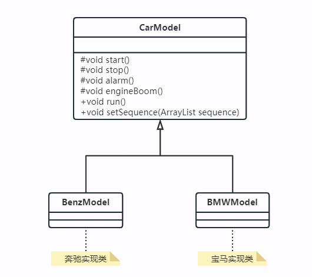
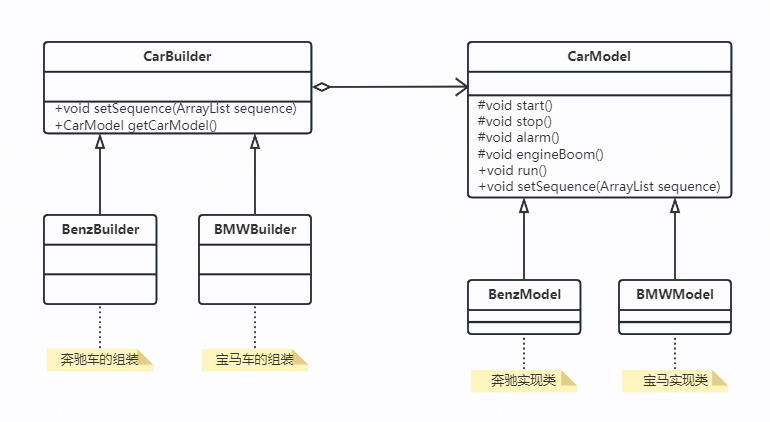
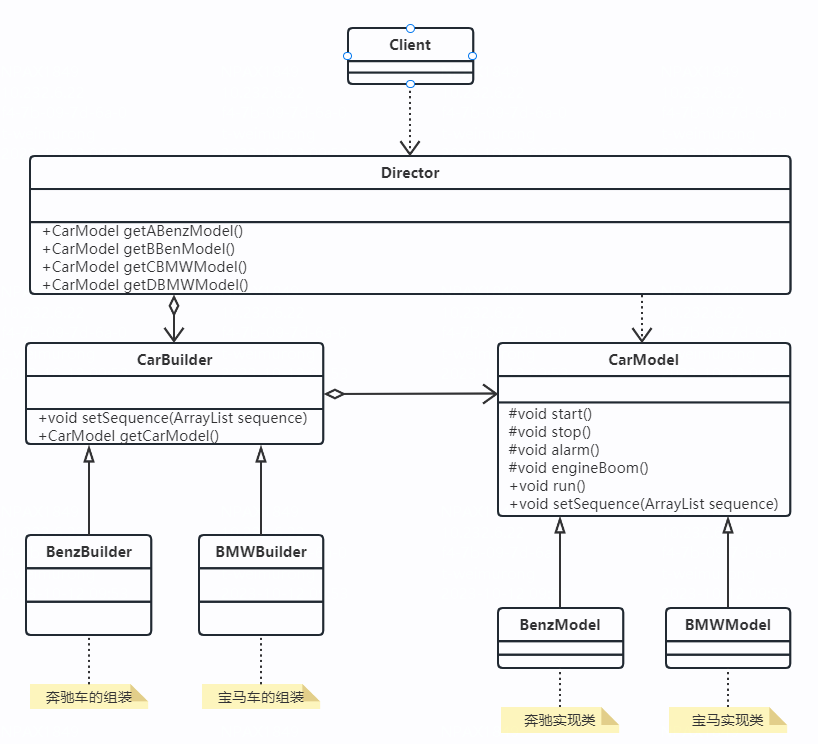
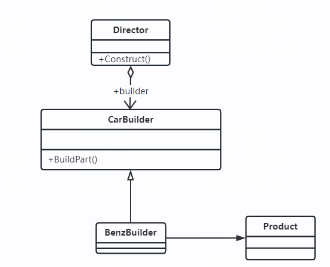
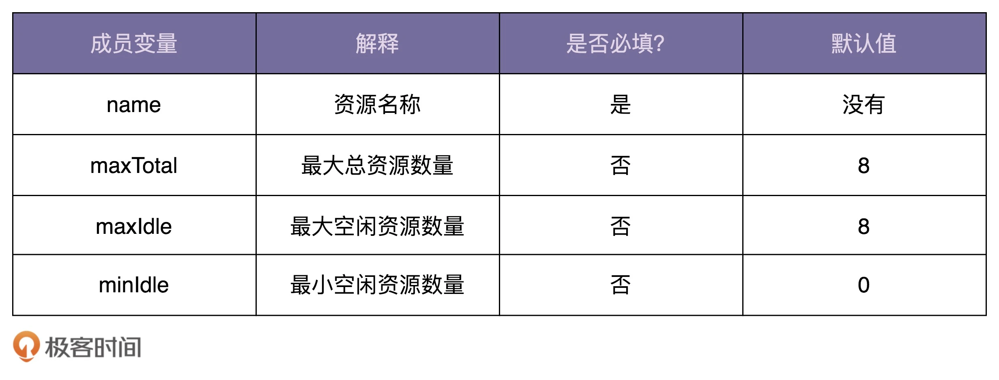

建造者模式
1 示例-变化是永恒的
1）示例1
（1）示例描述: 在悍马模型的基础上，又增加了一个业务制作奔驰宝马的模型，但是增加了一个需求，汽车的启动、停止、喇叭声音、引擎声音都由客户自己控制，想什么顺序就什么顺序  
（2）类图如下：

（3）分析：定义一个setSequence方法，车辆模型的动作由该方法决定  
（4）问题：场景类扩展性太差，如果要其它的顺序，就需要写很多场景  
2）示例改进  
（1）针对示例1的问题，我们为美中模型产品定义一个建造者，要啥顺序直接告诉建造者，由建造者来建造  
（2）类图

（3）分析：增加了一个CarBuilder抽象类，由它来组装各个车模，要什么类型什么顺序的车辆均是由相关的子类完成  
（4）总结：代码比直接访问产品类（Product）简单多了  
3）示例扩展  
（1）描述：客户的需求是无底洞的，也是无理性的，客户想怎么组合都行，想要喇叭而不想要引擎声  
（2）类图  

（4）分析：封装一下，找一个导演，指挥各个事件的先后顺序，然后为每种顺序制定一个代码，你说一种我们立刻就给你生产处理
* getABenzModel方法：启动（start）、停止（stop），没有引擎（engine boom）和喇叭（alarm）
* getBBenzModel方法：发动引擎（engine boom）、然后启动（start），然后停车（stop），没有喇叭（alarm）
* getCBMWModel方法：喇叭（alarm）、启动（start）、停车（stop），没有引擎（engine boom）
* getDBMWModel方法：启动（start），没有引擎（engine boom）、停车（stop）、喇叭（alarm）

2 建造者模式的定义  
2.1 定义：将一个复杂对象的构建与它的表示分离，使得同样的构建过程可以创建不同的表示  
2.2 类图  

2.3 角色描述  
* Product产品类：通常是实现了模板方法模式  
* Builder抽象建造者：规范产品的组建，一般是由子类实现  
* ConcreteBuilder具体建造者：实现抽象类定义的所有方法，并且返回一个组建好的对象
* Direct导演类：负责安排已有模块的殊勋，告诉Builder开始建造

3 建造者模式的应用  
3.1 优点
* 封装性：可以使客户端不必知道产品内部组成的细节
* 建造者独立，容易扩展
* 便于控制细节风险

3.2 使用场景
* 相同的方法，不同的执行顺序，产生不同的事件结果
* 多个部件或零件，都可以装配到一个对象中，但是产生的运行结果又不相同时，则可以使用该模式
* 产品类非常福周，或者产品类中的呃调用顺序不同产生了不同的效能
* 对象创建过程中会使用到系统的一些其它对象，这些对象在产品创建过程中不易得到时

3.3 注意事项
* 建造者模式关注的是零件类型和装配工艺（顺序），和工厂模式的注重点不同

3.4 扩展
* 建造者模式中还有一个角色没有说明，就是零件，零件的组装，组装顺序不同对象效能也不同，这才是建造者模式要表达的核心意义，通过引入模板方法模式可以非常简单有效的实现
* 建造者模式最主要的功能是基本方法的调用顺序安排，也就是是这些基本方法已经实现了，通俗地说就是零件的装配，顺序不同产生的对象不同；而工厂方法则重点是创建，创建零件是它的主要职责；

3.5 最佳实践
* 在使用建造者模式的时候，考虑一下模板方法模式，别孤立地思考一个模式，僵化地套用一个模式会让人受害无穷。

我们需要定义一个资源池配置类 ResourcePoolConfig。这里的资源池，你可以简单理解为线程池、连接池、对象池等。在这个资源池配置类中，有以下几个成员变量，也就是可配置项。现在，请你编写代码实现这个 ResourcePoolConfig 类。

问题：
直接使用构造函数或者配合set方法就能创建对象，为什么还需要建造者模式来创建？
建造者模式和工厂模式都可以创建对象，它们的区别在哪里？

实现方式
把构造函数定义为private
定义public static class Builder 内部类
通过Builder 类的set方法设置属性，调用build方法创建对象

使用场景
类的构造函数必填属性很多，通过set设置，没有办法校验必填属性
如果类的属性之间有一定的依赖关系，构造函数配合set方式，无法进行依赖关系和约束条件校验
需要创建不可变对象，不能暴露set方法。

和工厂模式的区别
工厂模式：用来创建不同但是相同类型的对象
建造者模式：用来创建一种类型的复杂对象，通过设置不同的可选参数，“定制化”地创建对象

