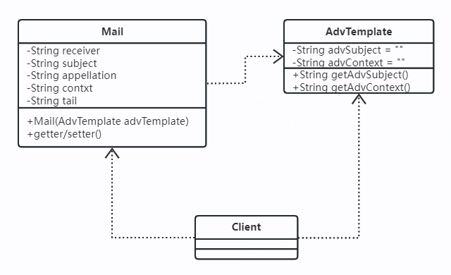
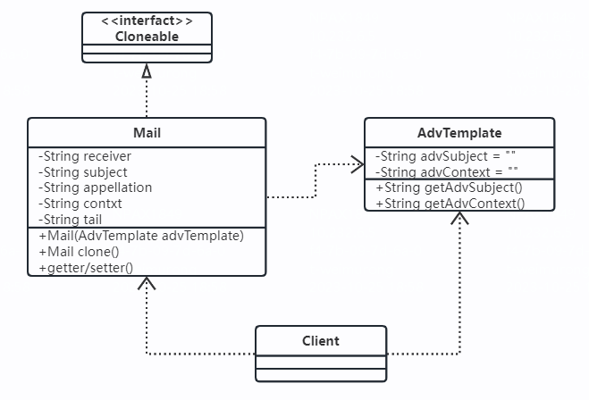
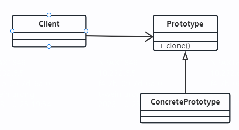

1.示例  
1.1 示例
* 描述：银行通过电子邮件发送账单邮件，具有以下要求：1）个性化服务，例如不同的个人信息；2）递送成功率，由于大批量地发送邮件会被接收方邮件服务器误认是垃圾邮件
* 其它：广告信的发送也是电子账单系统（电子账单系统一般包括：账单分析、账单生成器、广告信管理、发送队列管理、发送机、退信处理、报表管理等）的一个子功能
* 类图

* 问题：这是一个单线程，按照一封邮件发送出去需要0.02秒，600万封邮件需要33个小时，时间处理过长，可以通过对象的复制功能来解决这个问题
1.2 改进：
* 通过对象的复制来减少时间的损耗
* 类图

* 不通过new关键字产生一个对象，而是通过对象复制来实现的模式就叫做原型模式。

2.定义
2.1 定义：用原型实例制定创建对象的种类，并且通过拷贝这些原型创建新的对象
2.2 类图

2.3 描述：原型模式的核心是一个clone方法，通过该方法进行对象的拷贝，Java提供了一个Cloneable接口来标示这个对象是可拷贝的
2.4 源码

3.应用
3.1 优点
* 性能优良：是在内存二进制流的拷贝，要比直接new一个对象性能好很多
* 逃避构造函数的约束：内存中拷贝，构造函数是不会执行的
3.2 使用场景
* 资源优化场景
* 性能和安全要求的场景
* 一个对象多个修改者的场景
3.3 备注
* 原型模型很少单独出现，一般是和工厂方法模式一起出现，通过clone的方法创建一个对象，然后由工厂方法提供给调用者

3.4 注意事项
3.4.1 一个实现了Cloneable并重写了clone方法的类A，有一个无参构造或有参构造B，通过new关键字产生了一个对象S，再然后通过S.clone()方式产生了一个新的对象T，那么在对象拷贝时构造函数B不会被执行
3.4.2 浅拷贝
* Object类提供的方法clone只是拷贝本对象，其对象内部的数组、引用对象等都不拷贝，还是指向原生对象的内部元素地址，这种拷贝叫做浅拷贝  
* 引用的成员变量必须满足两个条件才不会被拷贝：一是类的成员变量，而不是方法内变量；而是必须是一个可变的引用对象，而不是一个原始类型或不可变对象
3.4.3 深拷贝
* 定义：实现了对象的完全拷贝，两个对象之间没有合个的瓜葛
* 实现方式：1.除了拷贝对象外，同时拷贝私有变量；2.通过二进制流来操作对象，实现对象的深拷贝
3.4.4 clone与final
* 对象的clone与对象内的final关键字是有冲突的。
* 是使用clone方法，类的成员变量上就不要增加final关键字，因为final是不可变的

3.5 最佳实践
* 先产生出一个包含大量公有信息的类，然后可以拷贝出副本，修正细节的场景

数据库中存储了大约 10 万条“搜索关键词”信息，每条信息包含关键词、关键词被搜索的次数、信息最近被更新的时间等。系统 A 在启动的时候会加载这份数据到内存中，用于处理某些其他的业务需求。为了方便快速地查找某个关键词对应的信息，我们给关键词建立一个散列表索引。

如果你熟悉的是 Java 语言，可以直接使用语言中提供的 HashMap 容器来实现。其中，HashMap 的 key 为搜索关键词，value 为关键词详细信息（比如搜索次数）。我们只需要将数据从数据库中读取出来，放入 HashMap 就可以了

1.为了保证数据的实时性，需要定期根据数据库中的数据，更新内存中的索引和数据

2.更新内存数据的时候，对象不能处于不可用状态，也就是不能停机更新数据：新增对象，而后切换

3.新增对象太慢，对原型进行深拷贝，然后从数据库只捞出新增或者更新的数据，更新到新对象中，而后切换

4.整个对象新增太慢，对原型进行前拷贝，然后从数据库捞出新增或更新的数据进行深拷贝