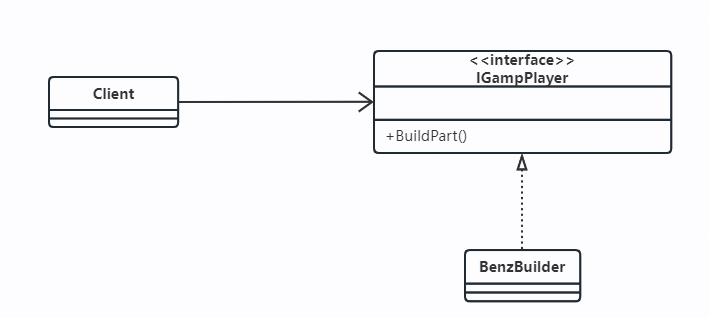
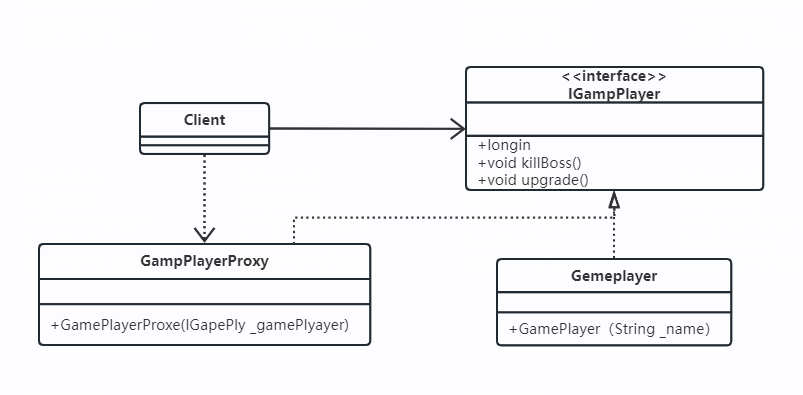
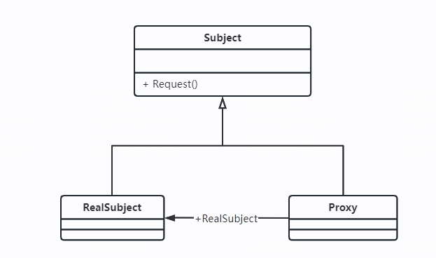
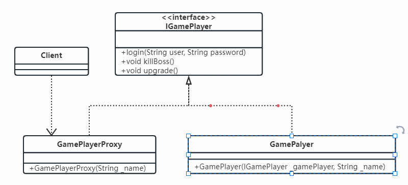
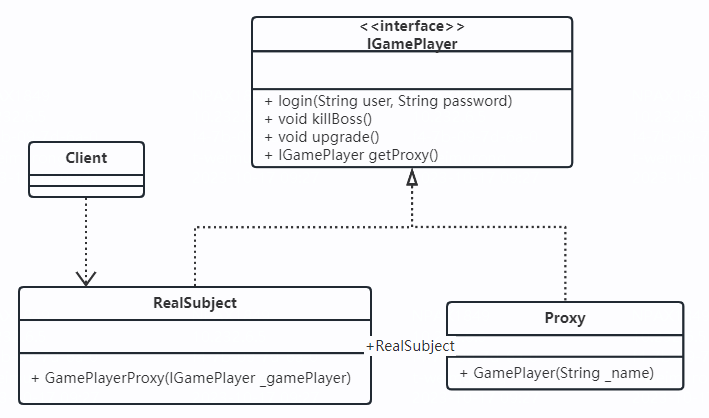
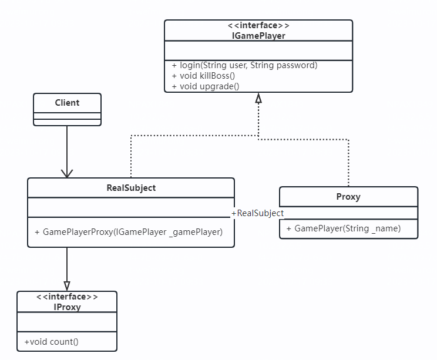
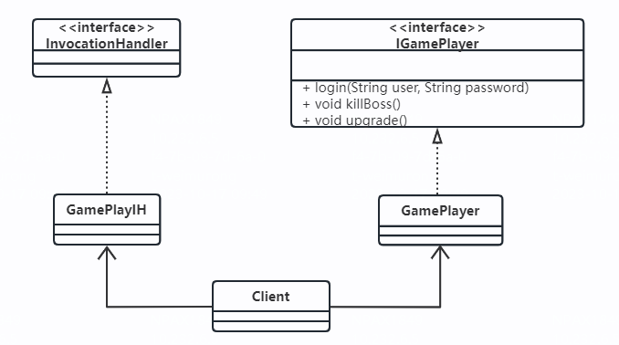
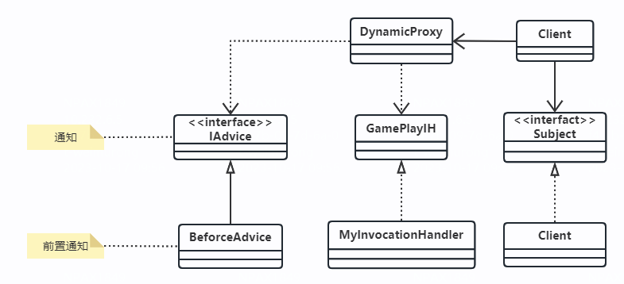

1 示例  
1.1 示例
* 描述：网络游戏实现打怪、升级
* 类图  

* 问题：游戏时间太长，腰酸背痛、眼睛干涩、手臂酸麻等
1.2 改进
* 描述：找个游戏代练，由他们去帮我升级打怪
* 类图

2 定义    
2.1 定义：为其他对象提供一种代理以控制对这个对象的访问  
2.2 类图

2.3 角色定义  
* Subject抽象主题角色：可以是抽象类也可以是接口，是一个最普通的业务类型定义，无特殊要求
* RealSubject具体主体角色：也叫做委托角色、被代理角色，是业务逻辑的具体执行者
* Proxy代理主题角色：负责对真是角色的应用，把所有抽象主题类定义的方法限制委托给真是主题角色的实现，并且在真实主题角色处理完毕前后做预处理和善后处理工作
* 一个代理类可以代理多个被委托者或被代理者，因此一个代理类具体代理哪个真实主题角色，由场景类决定的

3 应用
3.1 优点
* 职责清晰：真实的角色就是实现实际的业务逻辑，不用关心其它
* 高扩展性：具体主题角色可以随时变化而不会影响上层调用
* 智能化：动态代理
3.2 使用场景
* Spring AOP

4 扩展
4.1 普通代理
* 定义：要求客户端只能访问代理角色，而不能访问真实角色
* 类图

* 优点：屏蔽了真实角色的变更对高层模块的影响 
4.2 强制代理
* 定义：必须通过真实角色查找到代理角色，否则不能访问。即高层模块new了一个真实角色的对象，返回的却是代理角色
* 类图

* 备注：强制代理就是要从真实角色找到代理角色，不允许直接访问真实角色
4.3 代理是有个性的
* 定义：代理的目的是在目标对象方法的基础上作增强，这种增强的本质通常就是对目标对象的方法进行拦截和过滤
* 类图
* 
* 备注：通常情况下，代理的职责并不一定单一，他可以组合其它的真是角色，也可以实现自己的职责，例如计算费用
4.4 动态代理
* 定义：在实现阶段不用关心代理谁，而在运行阶段才制定代理哪一个对象，即横向切面变成AOP
* 示例类图

* 通用类图

* 注意：c.getInterfaces()这句话，这是说查找该类的所有接口，然后实现接口的所有方法
* 继续扩展：DynamicProxy类是一个通用类，不具有业务意义，如果我们再产生一个实现类是不是更有意义呢
* 注意：要实现动态代理的首要条件是：被代理类必须有一个接口，当然CGLIB可以实现不需要接口也可以实现动态代理

5 最佳实现 
5.1 友情提醒：在学习AOP框架时，弄清楚几个名词
* 切面(Aspect)
* 切入点(JoinPoint)
* 通知(Advice)
* 织入(Weave)
